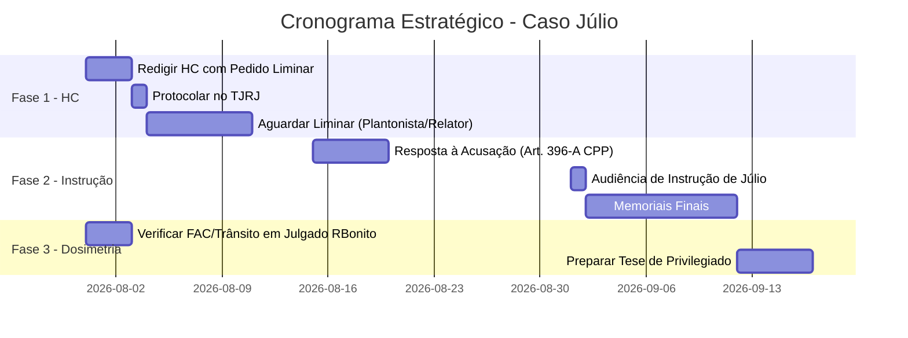

# 🛡️ ESTRATÉGIA DEFENSIVA DEFINITIVA — JÚLIO PEREIRA MARCOS
**Processo:** `0023013-51.2021.8.19.0078` | 2ª Vara de Búzios  
**Elaborado em:** 30/07/2026  
**Base:** Transcrição integral da audiência, Denúncia, Parecer do MP, Decisão de Fl. 1297, andamentos processuais  

---

## 📊 TRUNFOS DA DEFESA NOS AUTOS

| # | Fato Provado nos Autos | Impacto para a Defesa |
|---|---|---|
| **1** | Corréus (inclusive José Guilherme, pego com droga na mão) **soltos desde 02/08/2022** por excesso de prazo. | Isonomia obrigatória (Art. 580, CPP). |
| **2** | **Nenhuma droga jamais apreendida** com Júlio — nem em 2021, nem em 2026. | Fragilidade da materialidade e impossibilidade de exasperar pena-base por quantidade. |
| **3** | Delegado Rodrigo Moreira declarou em audiência: **"Não o risco de violência, não o risco de ordem pública."** | Crime sem violência — cautelares alternativas são suficientes. |
| **4** | Delegado Nelson Esquiva declarou: **"Eu não indiciei eles no crime de organização criminosa... não aquela divisão hierarquizada."** | Descaracterização do Art. 35 (associação). |
| **5** | Delegado Nelson Esquiva declarou: **"É uma relação de usuários que também vendem drogas."** | Perfil incompatível com traficância estruturada — favorece o tráfico privilegiado (§4º). |
| **6** | Operação classificada como **"Delivery"** de pequena escala, sem boca de fumo, sem arma, sem disputa territorial. | Desproporcionalidade da prisão preventiva. |
| **7** | Fatos investigados datam de **março a setembro de 2021** (5 anos atrás). | Quebra de contemporaneidade (Art. 312, §2º, CPP). |
| **8** | Decisão de Fl. 1297 (24/07/2026) contém apenas **2 linhas** sem fundamentação própria do Juiz. | Nulidade absoluta (Art. 315, §2º, V, CPP). |
| **9** | A própria Juíza titular sugeriu em audiência: **"O senhor pode ficar à vontade para impetrar o habeas corpus."** | Sinalização do próprio Judiciário de que a via do HC é legítima. |

---

## ⚔️ FASE 1: HABEAS CORPUS NO TJRJ (Soltura Imediata)

> [!IMPORTANT]
> **Objetivo:** Tirar Júlio da cadeia AGORA.  
> **Endereçamento:** Câmara Criminal do TJRJ  
> **Autoridade Coatora:** Dr. Danilo Marques Borges — 2ª Vara de Búzios

### Tese 1 — Falta de Contemporaneidade (Art. 312, §2º, CPP)

A prisão preventiva exige perigo **atual e concreto**. Os fatos são de 2021 — há 5 anos. Júlio foi capturado em 12/05/2026 sem nenhum grama de entorpecente em seu poder. Não existe nos autos qualquer indício de que tenha se envolvido com o tráfico entre 2022 e 2026.

**Prova nos autos para citar na peça:**
> Delegado Nelson Esquiva, em audiência: *"Não foram apreendidas drogas com eles."* (min. 16:49 da transcrição)

---

### Tese 2 — Extensão da Soltura dos Corréus (Art. 580, CPP)

Os 5 corréus da Operação Delivery — inclusive José Guilherme, que foi o único efetivamente apreendido com droga — foram liberados pela própria Juíza titular da 2ª Vara de Búzios em **02/08/2022** por excesso de prazo. Manter apenas Júlio preso, quando os demais respondem em liberdade, configura constrangimento ilegal por quebra da isonomia processual.

**Resposta ao contra-argumento do MP (Súmula 64/STJ):**
* A Súmula 64 impede a alegação de excesso de prazo *durante* a fuga, mas **não autoriza prisão cautelar perpétua após a captura**. Uma vez capturado, o prazo razoável recomeça a correr (STJ, HC 769.185/SP, 6ª Turma).
* Passados mais de **2 meses** da captura (12/05 a 30/07), a instrução sequer foi designada.

---

### Tese 3 — Nulidade da Decisão Coatora (Art. 315, §2º, V, CPP)

A decisão de Fl. 1297 (24/07/2026) se limita a:
> *"Acolho a manifestação ministerial de fls. 1293/1294 e A ADOTO COMO INTEGRAL RAZÃO DE DECIDIR. Logo, rejeito o pleito libertário."*

O Art. 315, §2º, V do CPP (Pacote Anticrime) proíbe expressamente decisão que *"se limita a invocar decisão ou parecer sem demonstrar a pertinência concreta"* com os argumentos apresentados pela defesa. O Juiz não enfrentou nenhuma das teses defensivas.

---

### Tese 4 — Desproporcionalidade da Prisão e Suficiência das Cautelares (Art. 282 §6º c/c Art. 319, CPP)

Os próprios delegados que conduziram a investigação reconheceram em juízo:

* **Sem violência:** *"Não o risco de violência, não o risco de ordem pública"* — Delegado Rodrigo Moreira (min. 1:37:05)
* **Sem organização criminosa:** *"Eu não indiciei eles no crime de organização criminosa... não aquela divisão hierarquizada, com subdivisões, com posição dentro de uma organização"* — Delegado Nelson Esquiva (min. 1:14:03)
* **Sem boca de fumo:** *"Não havia uma venda explícita nas ruas. Era uma coisa escamoteada, por isso até que a gente deu o nome de Delivery"* — Delegado Rodrigo Moreira (min. 7:52)
* **Perfil de usuários:** *"É uma relação de usuários que também vendem drogas"* — Delegado Nelson Esquiva (min. 50:13)
* **Sem vínculo enraizado com facção:** *"Se eles integram essa facção de forma enraizada, eu imagino que não"* — Delegado Nelson Esquiva (min. 1:15:25)

Crime sem violência + sem organização criminosa + sem armas + sem boca de fumo + fatos de 5 anos atrás = **a tornozeleira eletrônica e o comparecimento periódico são mais do que suficientes**.

**Pedido do HC:**
1. **Principal:** Concessão de Alvará de Soltura com medidas cautelares do Art. 319 (tornozeleira, comparecimento mensal, proibição de ausentar-se da comarca).
2. **Subsidiário:** Anulação da decisão de Fl. 1297 com imposição de liberdade até nova decisão fundamentada.

---

## ⚔️ FASE 2: DEFESA NO MÉRITO DA INSTRUÇÃO (1ª Instância)

> [!NOTE]
> A instrução de Júlio ainda não foi realizada (o processo foi desmembrado). Teses para Resposta à Acusação e Memoriais Finais.

### Tese A — Absolvição da Associação para o Tráfico (Art. 35, Lei 11.343/06)

O próprio Delegado Nelson Esquiva, responsável pelas interceptações, depôs em audiência:

* *"Todos eles têm aquela estabilidade, **mas não aquela divisão hierarquizada, com subdivisões, com posição dentro de uma organização** que pudesse gerar a tipificação de organização criminosa"* (min. 1:14:03)
* *"Eles não são traficantes do que se vê no normal das prisões flagrantes, aquele que a PM entra numa comunidade carente e encontra uma pessoa na esquina com saquinho de drogas, **eles não trabalham assim**"* (min. 1:14:51)
* *"É uma relação de **usuários que também vendem drogas**"* (min. 50:13)
* *"Se eles integram essa facção de forma enraizada, **eu imagino que não**"* (min. 1:15:25)
* O delegado fez questão de ressalvar no relatório final **por que não indicou organização criminosa** (min. 1:14:03)

O STJ (HC 623.411/SP, 6ª Turma) exige prova inequívoca de vínculo **estável e permanente** com divisão funcional de tarefas. Compras informais e indicações entre conhecidos/usuários não preenchem o tipo do Art. 35.

---

### Tese B — Fragilidade da Materialidade (Art. 33)

* **Nenhuma droga** foi apreendida em poder de Júlio — nem durante a Operação Delivery em 2022, nem na prisão de 12/05/2026.
* Delegado Nelson Esquiva confirmou: *"Não foram apreendidas drogas com eles"* (min. 16:49).
* **Sem laudo de apreensão de entorpecentes** vinculado diretamente ao réu.
* A ausência de apreensão impede o aumento da pena-base por "natureza e quantidade da droga" (Art. 42 da Lei 11.343/06).

---

## ⚔️ FASE 3: BLINDAGEM DE DOSIMETRIA (Se Condenado no Art. 33)

### 3A — Tráfico Privilegiado (Art. 33, §4º, Lei 11.343/06)

| Requisito do §4º | Situação de Júlio |
|---|---|
| Primário | Verificar FAC — se processo de Rio Bonito não tem trânsito em julgado, aplica-se Súmula 444/STJ |
| Bons antecedentes | Idem acima — vedado uso de inquéritos e ações em curso |
| Não se dedica a atividades criminosas | As interceptações cobrem apenas poucos meses de 2021, sem prova de continuidade |
| Não integra organização criminosa | **O próprio delegado descartou organização criminosa em audiência** |

**Impacto na pena:**
* Pena-base do Art. 33: **5 anos**
* Com redução de 2/3 (§4º): **1 ano e 8 meses** → Regime aberto + substituição por restritiva de direitos (Art. 44, CP)
* Com redução de 1/2: **2 anos e 6 meses** → Regime aberto

### 3B — Pena-Base no Mínimo Legal (Art. 59, CP)

* Sem droga apreendida = impossível exasperar por "quantidade e natureza".
* Súmula 444/STJ veda o uso do processo de Rio Bonito como maus antecedentes (se sem trânsito em julgado).

---

## 📋 CRONOGRAMA DE AÇÕES

---

## 🎯 RESUMO EXECUTIVO

| Fase | Ação | Tese Principal | Resultado Esperado |
|---|---|---|---|
| **1 (URGENTE)** | HC no TJRJ com liminar | Contemporaneidade + Corréus soltos + Decisão nula + Desproporcionalidade | **Alvará de Soltura ou Tornozeleira** |
| **2 (Instrução)** | Defesa no mérito | Absolvição do Art. 35 + Fragilidade material do Art. 33 | **Absolvição da Associação** |
| **3 (Dosimetria)** | Blindagem de pena | Tráfico Privilegiado §4º com redução de 2/3 | **Pena de 1a8m em regime aberto** |
