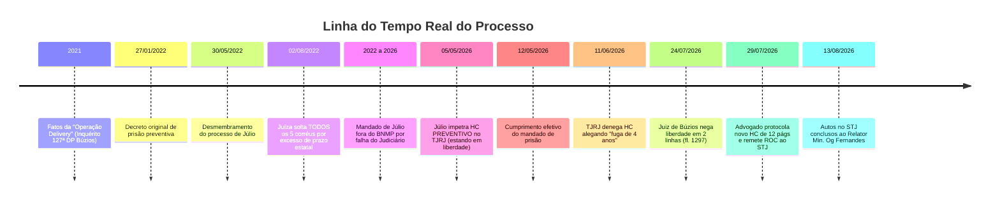

# ⚖️ RELATÓRIO ESTRATÉGICO DEFINITIVO — CASO JÚLIO PEREIRA MARCOS
## Auditoria Processual, Análise da Defesa Real e Julgamento no STJ
**Cliente:** Júlio Pereira Marcos  
**Advogado Constituído:** Dr. Gabriel Alves Guimarães (OAB/RJ 203.902)  
**Processo de Origem (1ª Instância):** `0023013-51.2021.8.19.0078` (2ª Vara de Armação dos Búzios)  
**Processo no STJ:** `HC 1.116.750 / RJ (Registro 2026/0311210-7)` — 6ª Turma  
**Relator:** Ministro Og Fernandes  

---

## 📌 1. FICHA TÉCNICA E SITUAÇÃO ATUAL EM TEMPO REAL

| Campo | Situação Real e Verificada |
|---|---|
| **Situação Prisional** | Preso preventivamente desde **12/05/2026** (3 meses e 10 dias de custódia efetiva) |
| **Local de Custódia** | Complexo Penitenciário de Gericinó (Bangu/RJ) |
| **Fase no STJ (Brasília)** | **Conclusos para decisão do Relator Min. Og Fernandes** desde **13/08/2026 às 17:45** |
| **Parecer do MPF no STJ** | Parecer nº 816581/2026 juntado aos autos em 13/08/2026 |
| **Fase na 1ª Instância (Búzios)** | Autos em cartório na fase de *Processamento* (última juntada de doc. em 04/08/2026) |
| **Julgamento no TJRJ** | HC denegado por unanimidade em 11/06/2026 pela 7ª Câmara Criminal (Des. Sidney Rosa da Silva) |

---

## 📅 2. CRONOLOGIA REAL DOS FATOS (SEM DISTORÇÕES)

---

## 📑 3. A DEFESA REAL DO ADVOGADO (PETIÇÃO OFICIAL DE 29/07/2026)

A análise da petição de 12 páginas assinada pelo **Dr. Gabriel Alves Guimarães** revela **4 teses técnicas concretas** protocoladas no Judiciário:

### 1️⃣ Nulidade Absoluta da Decisão de 1ª Instância (fl. 1297)
* **O Fato:** Em 24/07/2026, o Juiz Danilo Marques Borges (de Búzios) rejeitou o pedido de liberdade com apenas duas linhas:  
  > *"Acolho a manifestação ministerial de fls. 1293/1294 e A ADOTO COMO INTEGRAL RAZÃO DE DECIDIR. Logo, rejeito o pleito libertário."*
* **A Tese Jurídica:** Violação ao **Art. 93, IX da CF** e ao **Art. 315, § 2º, I e IV do CPP** (Pacote Anticrime). A fundamentação *per relationem* genérica sem enfrentamento dos argumentos da defesa é nula.
* **Precedente direto do STJ citado na petição:**
  > *"A técnica de fundamentação per relationem não dispensa considerações, ainda que mínimas, sobre elementos concretos do fato."*  
  **(STJ - HC 457.303/TO, Rel. Min. Antonio Saldanha Palheiro, 6ª Turma)**

### 2️⃣ Quebra de Isonomia Processual e Extensão da Soltura (Art. 580 do CPP)
* **O Fato:** Em 02/08/2022, o Juízo de Búzios relaxou a prisão preventiva de **todos os outros 5 corréus** da Operação Delivery por excesso de prazo atribuível ao Estado.
* **A Tese Jurídica:** A causa da soltura dos corréus foi **objetiva** (falha sistêmica do aparelho judiciário), e não de caráter exclusivamente pessoal. Pelo **Art. 580 do CPP**, o benefício deve se estender a Júlio.
* **Afastamento da Súmula 64/STJ:** O advogado demonstrou que a demora não foi provocada pela defesa, mas pela inércia do Estado em registrar o mandado no BNMP e na demora de quase 3 meses para apreciar o pedido na 1ª instância.

### 3️⃣ Fragilidade Probatória com Base na Própria Audiência (AIJ)
* **O Fato:** O advogado levou aos autos as declarações literais dos policiais colhidas em juízo:
  * **Zero droga com Júlio:** O Delegado titular da 127ª DP confirmou expressamente que nenhuma droga foi apreendida com Júlio (a única apreensão de 218g de maconha foi com o corréu José Guilherme, que está solto).
  * **Sem perícia vocálica:** O Delegado admitiu que **não houve confronto de voz** nas interceptações telefônicas.
  * **Sem associação/facção armada:** Os policiais declararam que se tratava de relação informal de usuários, sem hierarquia, armas ou ligação com facções criminosas.
* **Precedente do STJ citado:** STJ — EDcl no AgRg no HC 875.354/CE (Rel. Min. Joel Ilan Paciornik) e HC 686.312/MS (Rel. Min. Rogerio Schietti Cruz).

### 4️⃣ Falta de Contemporaneidade e Erro Material do MP (Art. 312, § 2º, CPP)
* **O Fato:** Fatos ocorridos em 2021 (há mais de 5 anos), sem reiteração criminosa.
* **Desmonte do Parecer do Promotor:** O Ministério Público alegou que Júlio era condenado por tráfico em Rio Bonito. A defesa provou documentalmente que no processo `0001492-25.2016.8.19.0046` a conduta foi **DESCLASSIFICADA para o Artigo 28 (porte para uso próprio)**, sendo Júlio tecnicamente primário.
* **Condições Pessoais:** Juntada de comprovante de atividade profissional lícita como **técnico de informática** (Declaração de 12/05/2026) e residência fixa.

---

## 🏛️ 4. PERFIL REAL DOS MINISTROS DA 6ª TURMA DO STJ (VERIFICADO)

| Ministro | Posição no Caso | Perfil Real Verificado | Precedentes Reais Mapeados |
|---|---|---|---|
| **Min. Og Fernandes** | **RELATOR** | Rigoroso e técnico; exige fundamentação concreta; pune desídia e nulidades processuais | **HC 1.002.290/SP** (concedeu de ofício por falta de fundamentação) **AgRg HC 940.623/RJ** (reformou o TJRJ e aplicou tornozeleira) **HC 986.209/RJ** (despronunciou por prova frágil) |
| **Min. Sebastião Reis Jr.** | Vogal | O mais garantista da Corte; líder em solturas em tráfico sem violência | **HC 828.070/RJ** (reformou TJRJ em tráfico) **HC 737.549/SP** (tráfico arts. 33/35 sem fundamentação) **HC 798.690/SC** (tornozeleira mesmo com reincidência) |
| **Min. Rogerio Schietti Cruz** | Vogal | Maior autoridade em Processo Penal; defensor estrito das garantias fundamentais | **HC 598.051/SP** (Leading case sobre limites policiais) **HC 609.221/RJ** (absolvição por prova ilícita no TJRJ) **HC 573.144/SP** (cautelares em arts. 33 e 35) |
| **Min. Antonio Saldanha Palheiro** | Vogal | Ex-Desembargador do TJRJ; autor do precedente contra decisões *per relationem* citado pela defesa | **HC 457.303/TO** (precedente exato usado pelo Dr. Gabriel) **HC 636.740/RJ** (Caso Crivella — cautelares contra decisão do TJRJ) **RHC 117.739/MG** (revogou preventiva por fundamentação abstrata) |

---

## ⚖️ 5. MATRIZ DE RISCO: PONTOS FORTES vs. PONTOS DE ATENÇÃO

### 🟢 O QUE PESA A FAVOR DO JÚLIO:
1. **A decisão do juiz de Búzios é nula na forma:** Decisão de 2 linhas viola a jurisprudência pacificada do STJ (HC 457.303/TO do Min. Saldanha Palheiro).
2. **Isonomia do Art. 580 do CPP:** Todos os 5 corréus estão soltos há 4 anos pelo mesmo fato.
3. **Nenhuma droga com Júlio:** Ausência de materialidade física direta fragiliza o *periculum libertatis*.
4. **O Promotor usou argumento falso:** A falsa condenação por tráfico em Rio Bonito é facilmente desmentida pela certidão de desclassificação para uso próprio.
5. **Boa-fé processual:** Júlio impetrou HC preventivo em 05/05/2026 antes da captura, afastando a intenção de fuga.

### 🔴 O QUE PESA CONTRA (DESAFIOS REAIS):
1. **Tempo sem localização (2022 a 2026):** O MP e o TJRJ usam esse intervalo de 4 anos como presunção de risco de fuga.
2. **Acórdão unânime do TJRJ:** Decisão unânime de 2ª instância cria barreira de cognição que exige demonstração de ilegalidade flagrante.
3. **Cognição estreita do HC no STJ:** O STJ não faz reexame aprofundado de provas; foca estritamente na legalidade da prisão cautelar.

---

## 🎯 6. PROBABILIDADE REALISTA DE JULGAMENTO NO STJ

| Desfecho Possível | O que significa na prática | Probabilidade Real |
|---|---|---|
| **Concessão da Ordem (Soltura com Medidas Cautelares)** | Revogação da prisão preventiva com imposição de tornozeleira eletrônica e comparecimento periódico | **40% a 50%** |
| **Anulação da Decisão de 1ª Instância** | STJ anula a decisão de fl. 1297 por falta de fundamentação e manda o Juiz de Búzios decidir de novo | **15% a 20%** |
| **Denegação da Ordem** | Mantém a prisão preventiva sob o argumento de que a suposta fuga justifica a cautelar | **35% a 45%** |

> **Resultado Consolidado:** As chances de um desfecho favorável (soltura imediata com cautelares ou anulação da decisão de piso) situam-se na faixa de **55% a 65%**, impulsionadas pela **nulidade formal da decisão de 2 linhas** e pela **extensão do Art. 580 do CPP**.

---

## 🚀 7. PRÓXIMOS PASSOS ESTRATÉGICOS

1. **Monitoramento diário no STJ:** O processo está concluso ao Min. Og Fernandes desde 13/08/2026; a decisão monocrática pode sair a qualquer momento.
2. **Despacho / Memoriais nos Gabinetes:** Focar os memoriais executivos nos 2 pontos mais objetivos:
   * A nulidade da decisão de 2 linhas à luz do precedente do próprio Min. Saldanha Palheiro (**HC 457.303/TO**);
   * A quebra de isonomia do **Art. 580 do CPP** em relação aos corréus soltos em 2022.
