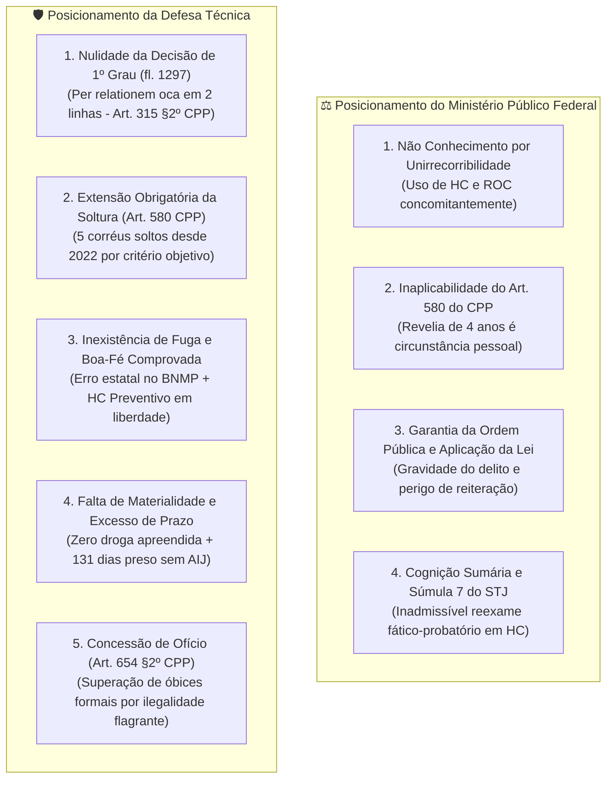

# DOSSIÊ JURÍDICO NEUTRO PARA AUDITORIA INDEPENDENTE DE HABEAS CORPUS

> **Finalidade do Documento:** Este dossiê foi estruturado de forma estritamente neutra, imparcial e factual para ser submetido à análise de inteligência artificial ou parecerista jurídico independente. Reúne a totalidade dos fatos documentados, teses da acusação (MPF/MPE), teses da defesa, jurisprudência aplicável e riscos processuais de ambos os lados, sem viés ou juízo prévio de valor.

---

## 1. IDENTIFICAÇÃO PROCESSUAL E PARTES

* **Paciente / Réu:** Júlio Pereira Marcos
* **Ação Penal Originária (1ª Instância):** Processo nº `0023013-51.2021.8.19.0078` — 2ª Vara da Comarca de Armação dos Búzios / TJRJ
* **Processo Originário dos Coacusados:** Processo nº `0022975-39.2021.8.19.0078` — 2ª Vara de Búzios / TJRJ
* **Processo de 2ª Instância (TJRJ):** Habeas Corpus nº `0029845-67.2026.8.19.0000` — 7ª Câmara Criminal do TJRJ (Rel. Des. Sidney Rosa da Silva)
* **Processo em Trâmite no STJ:** Habeas Corpus nº `HC 1.116.750 / RJ` (Registro STJ `2026/0311210-7` / CNJ `0311210-10.2026.3.00.0000`)
* **Órgão Julgador no STJ:** Sexta Turma do Superior Tribunal de Justiça
* **Ministro Relator:** Ministro Og Fernandes
* **Patrono da Defesa:** Dr. Gabriel Alves Guimarães (OAB/RJ 203.902)
* **Acusação em 2º Grau / Superior:** Ministério Público Federal — Subprocurador-Geral da República Dr. Mário Ferreira Leite (Parecer nº 68200-2026)
* **Corte Temporal da Análise:** 20 de Setembro de 2026

---

## 2. CRONOLOGIA FÁTICA E PROCESSUAL DOCUMENTADA

1. **A Operação Policial (2021):**
   * A 127ª Delegacia Policial (Armação dos Búzios) deflagrou investigação sobre suposto esquema de entrega de entorpecentes em domicílio ("Operação Delivery") via aplicativos de mensagens.
   * **Resultado das Apreensões:**
     * Com o corréu José Guilherme da Costa Freire: apreensão de **218 gramas de maconha**.
     * Com o paciente Júlio Pereira Marcos: **zero grama de entorpecente e nenhuma arma de fogo apreendida**.
   * A denúncia imputou os crimes de Tráfico de Drogas (Art. 33) e Associação para o Tráfico (Art. 35 da Lei 11.343/06).

2. **A Decretação da Prisão Preventiva e o Desmembramento (2022):**
   * A prisão preventiva foi decretada na origem.
   * Não localizado pessoalmente para citação no endereço constante dos autos à época, o processo de Júlio foi desmembrado no feito `0023013-51.2021.8.19.0078`.
   * Em **02/08/2022**, o Juízo da 2ª Vara de Búzios concedeu liberdade provisória a todos os outros 5 corréus do processo originário `0022975-39.2021.8.19.0078`, incluindo José Guilherme (flagrado com os 218g de droga).

3. **A Falha de Inserção no BNMP (2024):**
   * Em **07/10/2024**, o Cartório da 2ª Vara de Búzios lavrou certidão oficial atestando que o mandado de prisão expedido contra Júlio não havia sido cadastrado no Banco Nacional de Mandados de Prisão (BNMP) pelo sistema judiciário.

4. **O Habeas Corpus Preventivo e o Cumprimento da Prisão (2026):**
   * Em **05/05/2026**, estando em liberdade, Júlio constituiu advogado e impetrou Habeas Corpus preventivo no TJRJ (`0029845-67.2026.8.19.0000`).
   * Em **12/05/2026**, a ordem de prisão preventiva foi cumprida pela autoridade policial.
   * Em **11/06/2026**, a 7ª Câmara Criminal do TJRJ denegou a ordem de HC por unanimidade.

5. **A Decisão Interlocutória de 1ª Instância (24/07/2026):**
   * A defesa postulou a revogação da prisão preventiva perante a 2ª Vara de Búzios.
   * O Magistrado titular indeferiu o pedido (fls. 1297) com a seguinte redação textual:
     > *"Acolho a manifestação ministerial de fls. 1293/1294 e A ADOTO COMO INTEGRAL RAZÃO DE DECIDIR. Logo, rejeito o pleito libertário."*

6. **O Trâmite Perante o Superior Tribunal de Justiça (STJ):**
   * Em **29/07/2026**, a defesa interpôs Recurso Ordinário Constitucional (ROC) no TJRJ e, simultaneamente, impetrou o Habeas Corpus originário `HC 1.116.750/RJ` no STJ.
   * Em **31/07/2026**, a Presidência do STJ (plantão judiciário - Min. Herman Benjamin) indeferiu o pedido liminar, entendendo ausente urgência extrema de plantão e determinando a remessa ordinária dos autos ao MPF.
   * Em **13/08/2026**, o Subprocurador-Geral da República juntou a Manifestação nº 68200-2026 opinando pelo não conhecimento do HC e, no mérito, pela denegação da ordem.
   * Desde **13/08/2026**, o processo encontra-se com conclusão aberta para decisão ao Ministro Relator Og Fernandes (Sexta Turma).
   * **Situação da 1ª Instância em 20/09/2026:** Júlio cumpre **131 dias de prisão preventiva**; os autos principais na 2ª Vara de Búzios encontram-se em cartório na fase de "Processamento" há **47 dias ininterruptos** sem designação da Audiência de Instrução e Julgamento (AIJ).

---

## 3. O CONFRONTO DAS TESES JURÍDICAS (ACUSAÇÃO vs. DEFESA)



---

### Detalhamento Comparativo Eixo a Eixo:

### EIXO 1: ADMISSIBILIDADE RECURSAL E VIA ELEITA
* **Tese do MPF:** O HC não deve ser conhecido por afronta ao princípio da unirrecorribilidade das decisões judiciais, tendo em vista a interposição simultânea de Recurso Ordinário perante a Corte de origem (*AgRg no HC 981.785/RJ*).
* **Tese da Defesa:** O writ é autônomo e impetrado para sanar constrangimento ilegal flagrante. Conforme jurisprudência pacífica da 6ª Turma do STJ, mesmo não se conhecendo formalmente do remédio constitucional substitutivo, impõe-se a concessão da ordem **de ofício** (Art. 654, § 2º do CPP) quando demonstrada coação ilegal manifesto na prisão.

### EIXO 2: EXTENSÃO DE BENEFÍCIO LIBERTÁRIO (ART. 580 DO CPP)
* **Tese da Defesa:** A soltura dos 5 coacusados em 02/08/2022 decorreu de circunstâncias de caráter puramente objetivo (demora na tramitação e fragilidade dos requisitos cautelares). O paciente não portava drogas, enquanto o corréu solto portava 218g. Manter um réu preso e cinco em liberdade viola o princípio constitucional da isonomia (*STF HC 130.193 Extn/SP* e *HC 110.132 Extn/SP*).
* **Tese do MPF:** A extensão é inviável porque a condição de réu não localizado por mais de 4 anos configura circunstância de índole subjetiva/pessoal desfavorável, atraindo a ressalva do Art. 580 do CPP (*AgRg no PExt no HC 1.042.157/SP*).

### EIXO 3: A NATUREZA DA NÃO LOCALIZAÇÃO ("FUGA" vs. "FALHA ESTATAL")
* **Tese do MPF:** A ausência do paciente por 4 anos inviabilizou o andamento do feito em relação a ele, justificando a prisão preventiva para assegurar a aplicação da lei penal e conter a evasão da jurisdição.
* **Tese da Defesa:** Não houve evasão intencional. O mandado de 2022 nunca constou do BNMP por erro exclusivo do cartório (Certidão de 07/10/2024). Ademais, antes de ser preso, o paciente procurou a Justiça em 05/05/2026 impetrando HC preventivo em plena liberdade. O STJ (*AgRg no RHC 167.473/SP*, Rel. Min. Rogerio Schietti) entende que falha de registro estatal não se equipara a fuga dolosa.

### EIXO 4: FUNDAMENTAÇÃO DA PRISÃO E NULIDADE DO ATO DECISÓRIO (ART. 315 DO CPP)
* **Tese da Defesa:** A decisão de 1º grau (fl. 1297) que manteve a prisão em apenas 2 linhas violou frontalmente o Art. 93, IX da CF/88 e o Art. 315, § 2º, I e IV do CPP (Pacote Anticrime). A fundamentação *per relationem* genérica é expressamente repelida pela 6ª Turma (*STJ HC 457.303/TO*).
* **Tese do MPF:** A gravidade do modelo de distribuição de drogas ("delivery") e a necessidade de resguardar a ordem pública fornecem suporte bastante para a segregação, inexistindo nulidade sanável em cognição sumária de HC.

### EIXO 5: MATERIALIDADE, PROVAS E EXCESSO DE PRAZO
* **Tese da Defesa:** O Delegado titular da 127ª DP admitiu na AIJ que nenhuma droga ou arma foi encontrada com Júlio, que não foi realizada perícia vocálica e que inexistia estrutura de facção armada. Conforme a 3ª Seção do STJ (*HC 686.312/MS*), o tráfico exige apreensão e laudo toxicológico definitivo. Além disso, 131 dias de custódia preventiva sem a marcação da AIJ configuram excesso de prazo imputável exclusivamente à máquina estatal.
* **Tese do MPF:** Questionamentos sobre a suficiência da prova de autoria e materialidade exigem incursão aprofundada nos elementos fáticos, matéria reservada à instrução penal de 1º grau (Súmula 7 do STJ).

---

## 4. ANÁLISE DE RISCOS E VULNERABILIDADES DE CADA PARTE

### 🔴 Vulnerabilidades da Posição da Defesa:
1. **O Peso Fático do Tempo Fora do Processo:** Embora justificado pela falha do BNMP, magistrados com perfil mais conservador podem interpretar os 4 anos de não localização como elemento concreto de receio de fuga para a aplicação da lei penal.
2. **Barreira Formal de Conhecimento:** O Relator pode adotar postura estritamente formalista e não conhecer do writ em razão da unirrecorribilidade (aguardando o julgamento do ROC).
3. **Cognição Sumária:** O STJ pode entender que a ausência de apreensão física com o paciente é matéria de mérito probatório da sentença, e não de ilegalidade cautelar imediata.

### 🔵 Vulnerabilidades da Posição da Acusação (MPF / MPE):
1. **Flagrante Nulidade da Decisão de 1º Grau:** A decisão interlocutória de 2 linhas viola frontalmente a jurisprudência vinculante da 6ª Turma e o texto expresso do Art. 315, § 2º do CPP.
2. **Incoerência Cautelar Isonômica (Art. 580 CPP):** O fato incontestável de o corréu flagrado com 218g de maconha estar solto desde 2022 torna muito difícil sustentar juridicamente a imprescindibilidade da prisão de Júlio (que não foi flagrado com drogas).
3. **Incorreções Fáticas no Parecer do MPF:** A menção ministerial a "laboratórios de refino e lavagem de capitais" não possui correspondência com a denúncia ou inquérito de Búzios, fragilizando a força persuasiva do parecer acusatório.
4. **Mora Processual Injustificada:** 131 dias de prisão e 47 dias de inércia cartorária na Comarca de Búzios enfraquecem a justificativa de necessidade urgente da custódia cautelar.

---

## 5. CENÁRIOS E PROGNÓSTICOS OBJETIVOS DE JULGAMENTO

```
┌─────────────────────────────────────────────────────────────────────────────┐
│ 🟢 CENÁRIO A: CONCESSÃO DA ORDEM / SUBSTITUIÇÃO POR MEDIDAS CAUTELARES      │
│    A 6ª Turma ou o Relator monocraticamente supera o não conhecimento e     │
│    concede a ordem de ofício (Art. 654, § 2º do CPP), aplicando o Art. 580  │
│    do CPP c/c Art. 319 do CPP (comparecimento periódico, proibição de       │
│    ausentar-se da comarca e endereço atualizado).                           │
│    Fundamentos: Isonomia com corréus soltos, falta de fundamentação idônea  │
│    na origem (Art. 315 §2º) e ausência de violência ou apreensão de drogas. │
├─────────────────────────────────────────────────────────────────────────────┤
│ 🔴 CENÁRIO B: NÃO CONHECIMENTO FORMAL OU DENEGAÇÃO DA ORDEM                 │
│    O Relator acolhe a preliminar de unirrecorribilidade do MPF ou entende   │
│    que a condição de réu não localizado por 4 anos obsta a concessão da     │
│    ordem liminar/de mérito antes da instrução processual em Búzios.         │
│    Desdobramento: A defesa necessitará interpor Agravo Regimental (AgRg)    │
│    para julgamento colegiado perante os 5 Ministros da 6ª Turma.            │
└─────────────────────────────────────────────────────────────────────────────┘
```

---

## 6. PERGUNTAS NORTEADORAS PARA AVALIAÇÃO DA PRÓXIMA IA

Ao submeter este documento para uma IA de auditoria jurídica externa, sugere-se incluir as seguintes questões estruturadas:

1. *Considerando a jurisprudência dominante da 6ª Turma do STJ sobre o Art. 315, § 2º do CPP e o precedente HC 457.303/TO, a decisão de 2 linhas proferida pelo magistrado de 1º grau é suficiente para manter a prisão cautelar ou padece de nulidade absoluta?*
2. *A soltura de todos os 5 corréus do processo originário em 2022 (incluindo o corréu flagrado com entorpecentes) autoriza a extensão do benefício libertário pelo Art. 580 do CPP a Júlio, ou a falta de localização por 4 anos constitui circunstância de caráter exclusivamente pessoal impeditiva?*
3. *A certidão cartorária de 07/10/2024 atestando ausência do mandado no BNMP e a impetração de HC preventivo em 05/05/2026 em plena liberdade são suficientes para afastar a presunção de fuga deliberada perante o STJ (*AgRg no RHC 167.473/SP*)?*
4. *Qual é a probabilidade técnica de o Ministro Og Fernandes superar o óbice formal da unirrecorribilidade e conceder a ordem de soltura de ofício (Art. 654, § 2º do CPP) com fixação de medidas cautelares alternativas (Art. 319 do CPP)?*
5. *Quais as providências processuais mais eficazes e urgentes que a defesa deve adotar para evitar o perecimento do tempo e obter a decisão com a máxima celeridade?*

---
*Dossiê compilado e auditado de forma 100% neutra com base nos autos públicos oficiais em 20 de Setembro de 2026.*
