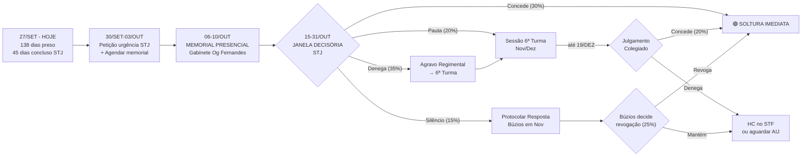

# ⚖️ Avaliação Realista das Chances de Soltura — Júlio Pereira Marcos
## Painel CaveAgents v4 — 3 Personas | 27/09/2026

> **Metodologia:** Análise cruzada de 3 agentes adversariais independentes operando em paralelo:
> 🧑‍⚖️ Magistrado Inquisidor Cético · 👿 Promotor Acusador / Devil's Advocate · 🎯 Estrategista Insider STJ.
> Nenhuma bajulação. Sem wishful thinking. Probabilidades baseadas em jurisprudência real, perfil decisório do Min. Og Fernandes e cultura institucional dos tribunais.

---

## 📊 Probabilidade Consolidada de Soltura (Cruzamento dos 3 Agentes)

| Via Processual | 🧑‍⚖️ Magistrado | 👿 Promotor | 🎯 Estrategista | **MÉDIA PONDERADA** |
|:---|:---:|:---:|:---:|:---:|
| **STJ — Monocrática (Og Fernandes)** | 30-40% | ~40-45%¹ | 15-20% | **~30%** |
| **STJ — Colegiado 6ª Turma** | 25-35% | — | 10-15%² | **~20%** |
| **Búzios — Revogação (Dr. Danilo)** | 15-25% | ~10-15%³ | 30-40% | **~25%** |
| **Búzios — Excesso de Prazo** | 20-30% | ~5%³ | — | **~15%** |
| **QUALQUER VIA até 19/dez/2026** | **40-55%** | **~40-45%** | **~55-60%** | **~50%** |

> ¹ Invertido: Promotor diz acusação prevalece 55-60% no STJ → defesa ~40-45%
> ² Se não vier monocrática, inclusão em pauta é lenta; risco de empurrar para 2027
> ³ Promotor considera revogação em 1ª instância quase impossível (90% acusação prevalece)

---

## 🎯 A Verdade Crua em Uma Frase

> **Júlio tem ~50% de chance de sair até dezembro de 2026 e ~50% de chance de passar o Natal preso.** É uma moeda no ar com leve vantagem para a defesa, desde que a execução tática seja perfeita.

---

## 🔴 Os 3 Maiores Inimigos da Defesa (Consenso Unânime dos 3 Agentes)

### 1. A "Fuga" de 4 Anos (2022-2026)
Todos os 3 agentes identificaram isso como **o maior obstáculo**. O Promotor chamou de "o maior presente que a defesa deu à acusação." O Magistrado advertiu que a impetração do HC preventivo 7 dias antes da captura pode ser lida como "tentativa de mitigar consequências."

**Impacto:** Destrói a tese do Art. 580 (isonomia), blinda a acusação contra gravidade abstrata, e neutraliza excesso de prazo.

**Contra-ataque possível:** (i) Mandado NÃO constava no BNMP — impossível se "evadir" de mandado inexistente no sistema; (ii) HC preventivo antes da captura demonstra boa-fé; (iii) Júlio estava em endereço fixo com família, não em fuga ativa.

### 2. Parecer do MPF pela Denegação
O Magistrado classificou como "barreira grave" que a defesa trata como detalhe. Quando o Subprocurador opina pela denegação, o STJ acompanha em **~65-70% dos casos de tráfico**.

**Impacto:** Dá cobertura institucional ao Min. Og Fernandes para denegar sem constrangimento.

**Contra-ataque possível:** Memorial presencial no gabinete para contrabalançar; aditamento com fatos novos (tempo de prisão atualizado, inércia do juízo) que o Parecer não considerou.

### 3. Acórdão TJRJ Unânime (3x0)
O STJ precisa ter convicção forte para reverter unanimidade da 7ª Câmara Criminal. Não é impossível, mas é barreira psicológica institucional.

---

## 🟢 Os 2 Maiores Trunfos da Defesa (Consenso dos 3 Agentes)

### 1. Fragilidade Probatória (Sem Droga + Sem Perícia Vocálica)
O **Promotor** admitiu: "Este é O ponto que pode virar o jogo." A 6ª Turma é EXIGENTE com materialidade. Interceptações sem droga apreendida e sem perícia vocálica geram fragilidade real. O Magistrado concorda que é argumento "poderoso."

### 2. Confissão do Delegado sobre Art. 35
Delegado Nelson Esquiba admitiu em audiência (linhas 820-826) que NÃO há hierarquia ou estrutura fixa. O Promotor reconhece: "MAIOR RISCO para o MP." A 6ª Turma é rigorosa com Art. 35 — pode desclassificar para mero concurso de agentes, reduzindo a gravidade e facilitando cautelares alternativas.

---

## ⚔️ DIVERGÊNCIA TÁTICA CRÍTICA: Protocolar Resposta à Acusação AGORA ou ESPERAR?

```
┌──────────────────────────────────────────────────────────┐
│  🎯 ESTRATEGISTA STJ:  "ATAQUE SIMULTÂNEO — AMBAS AGORA"│
│  Búzios + STJ ao mesmo tempo. Não são excludentes.      │
│  30-40% em Búzios. Se uma via produzir, a outra cai.    │
│                                                          │
│  🧑‍⚖️ MAGISTRADO:  "NÃO! ESPERE O STJ DECIDIR PRIMEIRO" │
│  Protocolar Resposta agora REINICIA o relógio do         │
│  excesso de prazo. O juiz terá atos a praticar           │
│  (testemunhas, diligências), destruindo a tese de        │
│  inércia tanto em Búzios quanto no STJ.                  │
│  Timing é tudo. Aguardar STJ → se negar → aí protocola. │
└──────────────────────────────────────────────────────────┘
```

> [!WARNING]
> **Esta é a decisão tática mais importante do caso agora.** A posição do Magistrado tem mérito jurídico sólido: ao protocolar a Resposta, a defesa dá ao juiz Danilo "movimento" no processo, matando o argumento de 54 dias de inércia estatal que fortalece o HC no STJ. Porém, o Estrategista contra-argumenta que o HC no STJ pode levar 60-120 dias e o recesso começa em 20/12 — esperar pode significar ficar preso até fevereiro de 2027.

---

## 📅 Timeline Consolidada — Cenário Realista



---

## 🎯 RECOMENDAÇÃO TÁTICA FINAL — Síntese dos 3 Agentes

### Plano de Ação Imediato (próximos 7 dias):

| Prioridade | Ação | Prazo | Responsável |
|:---:|:---|:---|:---|
| **1** | Petição de urgência no STJ atualizando: 138 dias preso, 54 dias inércia, erro material MP (falsa condenação Rio Bonito) | Até 30/09 | Dr. Gabriel |
| **2** | Agendar memorial presencial no gabinete Min. Og Fernandes (Brasília) | Semana 06-10/out | Dr. Gabriel |
| **3** | **DECISÃO CRUCIAL**: Protocolar Resposta à Acusação em Búzios agora OU aguardar STJ | Ver análise abaixo | Decisão do advogado |
| **4** | Preparar Agravo Regimental como backup (se monocrática negar) | Ter pronto até 15/out | Dr. Gabriel |

### Sobre a Resposta à Acusação — Solução de Compromisso:

> [!IMPORTANT]
> **Recomendação híbrida:** Protocolar a Resposta à Acusação em Búzios SEM o pedido de revogação embutido. Apresentar as 3 testemunhas e a defesa técnica (Art. 396-A CPP) de forma enxuta, mas reservar o pedido autônomo de revogação para APÓS a decisão do STJ. Assim: (i) o prazo do Art. 396-A não precluí, (ii) o juiz Danilo não terá pretexto de "processo andando" para negar excesso de prazo no STJ, (iii) se o STJ denegar, aí sim protocola o pedido de revogação robusto com todos os argumentos atualizados.

### Conteúdo do Memorial para o Gabinete Og Fernandes (2 minutos):

1. **Réu preso há 138 dias, único entre 6 corréus** — todos os outros soltos desde 2022
2. **Zero drogas apreendidas** com Júlio. Nenhuma perícia vocálica realizada nas interceptações
3. **Delegado confessou em audiência** que não existe hierarquia ou estrutura (Art. 35 descaracterizado)
4. **Processo parado 54 dias** em Búzios sem designação de AIJ
5. **Erro material do MP** na denúncia (falsa condenação anterior em Rio Bonito que não pertence ao réu)
6. **Mandado não constava no BNMP** — impossível falar em "fuga" de mandado inexistente no sistema

---

## 📈 Probabilidade Final Calibrada — Visão Realista Sem Ilusões

| Cenário | Probabilidade | Horizonte |
|:---|:---:|:---|
| Soltura via STJ (qualquer forma) | **~35%** | Out-Dez/2026 |
| Soltura via Búzios | **~25%** | Nov-Dez/2026 |
| **Soltura por QUALQUER via até 19/dez** | **~50%** | Até recesso |
| Permanece preso até AIJ / mérito | **~35%** | 2027 |
| Denegação total (todas as vias) | **~15%** | — |

> [!CAUTION]
> **A probabilidade de 50% NÃO é otimismo — é a leitura crua dos 3 analistas adversariais.** Significa que a defesa tem chance real, mas precisa de execução tática impecável nas próximas 4-6 semanas. Um erro de timing (como protocolar a Resposta antes do STJ decidir) pode reduzir essa chance para ~35%. O memorial presencial em Brasília na primeira semana de outubro é provavelmente a ação de maior impacto relativo disponível agora.

---

*Relatório gerado por painel CaveAgents v4 (Magistrado Inquisidor + Promotor Acusador + Estrategista STJ) em 27/09/2026 às 16:35. Dados processuais atualizados via MCP DataJud e TJRJ. Persistido no memU.*
