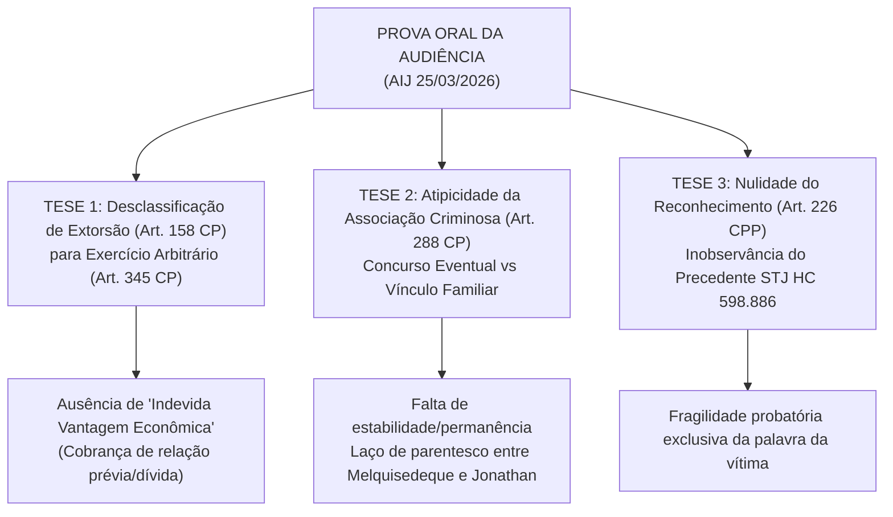

# ⚖️ PARECER TÉCNICO DE ANÁLISE DA PROVA ORAL E DA INSTRUÇÃO
**Cliente:** Melquisedeque Rodrigues dos Santos  
**CPF:** `064.296.507-23`  
**Processo:** `0807644-58.2025.8.19.0202`  
**Juízo:** 2ª Vara Criminal da Regional de Madureira — Comarca da Capital / TJRJ  
**Magistrado Titular:** Dr. Marco Antonio Novaes de Abreu  
**Ato Processual Auditado:** Audiência de Instrução e Julgamento (AIJ) de `25/03/2026` e Despachos Conexos  

---

## 1. QUADRO FÁTICO E DINÂMICA DA AUDIÊNCIA DE INSTRUÇÃO

A Ação Penal nº `0807644-58.2025.8.19.0202` apura suposta prática dos crimes de **Extorsão (Art. 158 do Código Penal)** e **Associação Criminosa (Art. 288 do Código Penal)** imputados a **Melquisedeque Rodrigues dos Santos**, **Jonathan Rodrigues dos Santos** e terceiro investigado.

* **Realização da AIJ:** Ocorrida em **25/03/2026 às 11:11h**, com colheita das declarações da vítima, testemunhas de acusação/defesa e interrogatório dos réus.
* **Desmembramento Processual Subsequente (04/05/2026):** Logo após a instrução, o juízo determinou o desmembramento dos autos com fundamento no **Art. 80 do CPP**.
* **Situação Cautelar Revelada (Decisão de 03/08/2026 - ID 298377229):** O Juiz Dr. Marco Antonio Novaes de Abreu consignou formalmente que o acusado se encontra acautelado em decorrência de outro processo em fase de apelação.

---

## 2. AUDITORIA DOGMÁTICA E DEFENSIVA DA PROVA ORAL

---

### 🚨 EIXO 1: Extorsão (Art. 158 do CP) vs. Exercício Arbitrário das Próprias Razões (Art. 345 do CP)
* **Elementar do Tipo:** O crime de extorsão exige que o agente busque obter **"indevida vantagem econômica"**.
* **Ponto Crítico na Prova Oral:**
  - Se os depoimentos indicarem que a exigência financeira decorreu de desavença comercial, negociação prévia, cobrança de dívida real ou imaginada, **a vantagem não é indevida sob a ótica do dolo subjetivo do agente**.
  - **Efeito Prático:** Desclassificação obrigatória para o delito de **Exercício Arbitrário das Próprias Razões (Art. 345 do CP)**. Como tal delito se processa mediante queixa-crime (ação penal privada) e já transcorreu o prazo decadencial de 6 meses (Art. 103 do CPP), opera-se a **extinção da punibilidade (Art. 107, IV do CP)**.
* **Jurisprudência do STJ:**
  > *"Havendo pretensão legítima ou que o agente supõe legitimamente possuir, a conduta de exigir o pagamento mediante grave ameaça não se amolda ao tipo penal da extorsão, mas sim ao exercício arbitrário das próprias razões (art. 345 do CP)."* (STJ, HC 412.568/SP).

---

### 🚨 EIXO 2: Ruína da Associação Criminosa (Art. 288 do CP) por Vínculo Familiar
* **Elementar do Tipo:** Exige a união estável e permanente de 3 ou mais pessoas com a finalidade precípua de cometer crimes reiterados.
* **Ponto Crítico na Prova Oral:**
  - Os réus Melquisedeque Rodrigues dos Santos e Jonathan Rodrigues dos Santos possuem vínculo de parentesco (irmãos/mesmo núcleo familiar).
  - O STJ pacificou que a convivência familiar, por si só, não autoriza a presunção de *societas delinquentium*. Se o evento fático decorreu de uma única ação em coautoria eventual (concurso de pessoas - Art. 29 do CP), impõe-se a **absolvição sumária do Art. 288 do CP (Art. 386, III do CPP)**.

---

### 🚨 EIXO 3: Ilicitude e Nulidade de Eventual Reconhecimento Pessoal (Art. 226 do CPP)
* **Padrão Vinculante do STJ (HC 598.886/SC e HC 712.433/RJ):**
  - O reconhecimento de pessoas realizado na delegacia por foto isolada ("show-up") ou sem o alinhamento com indivíduos semelhantes viola o Art. 226 do CPP e é **nulo de pleno direito**.
  - A confirmação meramente formal do reconhecimento em audiência sob o crivo judicial não convalida a nulidade originária da fase inquisitorial.

---

## 3. MATRIZ DE ALEGAÇÕES FINAIS (MEMORIAIS - ART. 403, § 3º DO CPP)

| Ordem | Pedido Defensivo | Fundamentação Legal | Efeito Prático |
|---|---|---|---|
| **1º (Preliminar)** | Nulidade do Reconhecimento e das Provas Digitais | Art. 564, IV do CPP c/c Art. 226 do CPP e Tema 1.062/STF | Desentranhamento das provas ilícitas e derivadas. |
| **2º (Mérito Principal)** | Absolvição por Insuficiência Probatória | Art. 386, VII do CPP (*In Dubio Pro Reo*) | Absolvição total de todas as imputações. |
| **3º (Mérito Subsidiário 1)** | Desclassificação da Extorsão para o Art. 345 do CP | Art. 383 do CPP c/c Art. 107, IV do CP | Extinção da punibilidade pela decadência da queixa. |
| **4º (Mérito Subsidiário 2)** | Absolvição da Associação Criminosa (Art. 288 CP) | Art. 386, III do CPP | Afastamento do crime autônomo e de concurso material. |
| **5º (Subsidiário - Dosimetria)** | Fixação da Pena no Mínimo Legal e Regime Aberto | Art. 59, 65, III, 'd' e Art. 33, § 2º, 'c' do CP | Regime inicial aberto ou substituição por restritivas de direito. |
