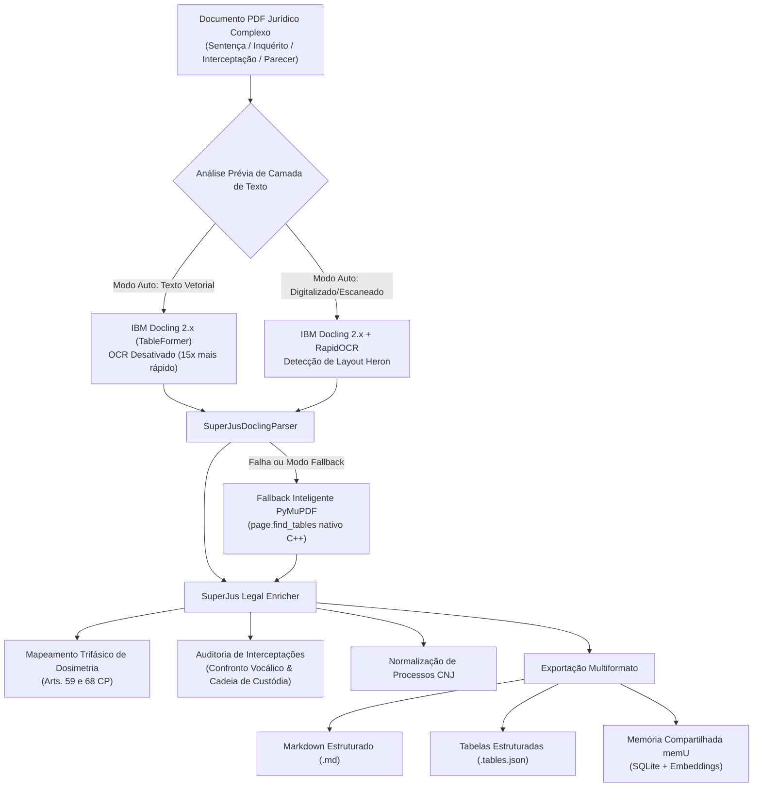

# Guia de Integração do IBM Docling no Ecossistema SuperJus

## 1. Visão Geral e Propósito Estratégico

O ecossistema **SuperJus** lida diariamente com centenas de peças processuais criminais complexas:
- Sentenças condenatórias com dosimetria trifásica da pena (Art. 59 e Art. 68 do Código Penal);
- Relatórios de interceptações telefônicas e telemáticas com matrizes de chamadas, alvos, IMEIs e interlocutores;
- Espelhos e andamentos de sistemas dos Tribunais (PJe, Projudi, E-Proc, TJRJ, STJ);
- Pareceres ministeriais e acórdãos com tabelas de confronto e jurisprudência vinculante.

Os conversores tradicionais de PDF (extratores puramente baseados em texto linear) falham sistematicamente na leitura de tabelas complexas, embaralhando colunas, fundindo linhas de réus distintos e desestruturando a hierarquia do raciocínio judicial.

Para solucionar essa fragilidade estrutural, integramos o **IBM Docling 2.x** ao SuperJus, dotando a banca de advocacia e os agentes autônomos (**Hermes Agent**, **Antigravity** e **OpenCode**) de capacidade de visão computacional de layouts, reconstrução exata de tabelas via **TableFormer** e conversão limpa para Markdown estruturado.

---

## 2. Arquitetura do Sistema



---

## 3. Instalação e Ambiente

O IBM Docling está plenamente homologado no ambiente Python 3.11 do SuperJus com todas as dependências nativas (Torch, Vision, RapidOCR e docling-ibm-models).

### Comando de Instalação
```bash
pip install docling
```

### Fallback Inteligente Nativo
Caso o ambiente não disponha de aceleração gráfica ou dependências de IA (ou se houver necessidade de conversão sub-segundo), o módulo aciona de forma 100% transparente o **PyMuPDFTableFallback** (`fitz.find_tables()`), garantindo que **nenhuma esteira de trabalho seja interrompida por erro de ambiente**.

---

## 4. Scripts e Componentes Criados

| Arquivo | Função Principal |
| :--- | :--- |
| [`scripts/superjus_docling_parser.py`](file:///c:/Projetos/superJus/scripts/superjus_docling_parser.py) | Motor mestre de conversão de PDFs jurídicos, CLI, API Python e extratores criminais. |
| [`scripts/superjus_docling_integration_demo.py`](file:///c:/Projetos/superJus/scripts/superjus_docling_integration_demo.py) | Script demonstrativo de integração com o fluxo de analista e gravação no `memU`. |
| [`docs/DOCLING_SUPERJUS_INTEGRATION.md`](file:///c:/Projetos/superJus/docs/DOCLING_SUPERJUS_INTEGRATION.md) | Documentação técnica completa e manual de operação. |

---

## 5. Como Utilizar (CLI - Linha de Comando)

### Conversão Simples para Markdown
```bash
python scripts/superjus_docling_parser.py "caminho/do/arquivo.pdf"
```

### Conversão com Exportação de Tabelas em JSON
Gera o `.md` e um arquivo paralelo `.tables.json` com cada tabela indexada:
```bash
python scripts/superjus_docling_parser.py "caminho/do/arquivo.pdf" -o "saida.md" --export-tables
```

### Otimização de OCR (Auto / Force / Off)
```bash
# Recomendado para decisões e relatórios digitais (máxima velocidade):
python scripts/superjus_docling_parser.py "caminho/do/arquivo.pdf" --ocr off

# Forçar OCR para inquéritos e laudos escaneados:
python scripts/superjus_docling_parser.py "caminho/do/arquivo.pdf" --ocr force
```

### Conversão em Lote (Diretório Inteiro de Cliente)
Converte recursivamente todos os PDFs de um cliente:
```bash
python scripts/superjus_docling_parser.py --batch-dir "c:\Projetos\superJus\Clientes\Júlio_Pereira_Marcos" --export-tables
```

### Execução via Fallback Ultrarrápido (< 1s)
```bash
python scripts/superjus_docling_parser.py "caminho/do/arquivo.pdf" --engine fallback
```

---

## 6. Utilização via API Python

Qualquer script ou skill do SuperJus pode importar diretamente o parser:

```python
from pathlib import Path
from scripts.superjus_docling_parser import SuperJusDoclingParser, parse_pdf

# Uso rápido de alto nível:
resultado = parse_pdf(
    pdf_path="c:/Projetos/superJus/Clientes/Júlio_Pereira_Marcos/.../parecer.pdf",
    output_md_path="saida_analise.md",
    export_tables_json=True,
    ocr_mode="auto",
)

print(f"Motor utilizado: {resultado.engine_used}")
print(f"Total de tabelas: {len(resultado.tables)}")
print(f"CNJs identificados: {resultado.processos_cnj}")

# Acessar tabelas como DataFrames ou Dicionários:
for tabela in resultado.tables:
    print(f"Tabela #{tabela.index} - Linhas: {tabela.rows_count} x Colunas: {tabela.cols_count}")
    print(tabela.markdown)
```

---

## 7. Módulos de Inteligência Criminal SuperJus

O `SuperJusDoclingParser` não se limita a extrair texto; ele aplica heurísticas jurídicas refinadas:

### 1. Dosimetria da Pena (Arts. 59 e 68 do CP)
- **1ª Fase:** Detecta pena-base e circunstâncias judiciais valoradas negativamente (culpabilidade, antecedentes, conduta social, personalidade, motivos, circunstâncias, consequências, comportamento da vítima).
- **2ª Fase:** Detecta atenuantes (confissão espontânea, menoridade) e agravantes (reincidência, calamidade pública).
- **3ª Fase:** Detecta minorantes (tráfico privilegiado § 4º do art. 33 da Lei 11.343/06) e majorantes do art. 40.
- **Pena Final e Regime:** Extrai pena definitiva, regime inicial fixado (fechado, semiaberto, aberto) e viabilidade de substituição por restritivas de direitos (Art. 44 do CP).

### 2. Auditoria de Interceptações Telefônicas & Telemática
- Mapeia terminais telefônicos, IMEIs, interlocutores e número de diálogos.
- Emite alerta estratégico caso falte **Laudo de Confronto Vocálico** (precedente **STJ HC 512.278/SP**).
- Audita integridade da cadeia de custódia e prova digital (Arts. 158-A a 158-F do CPP).

---

## 8. Integração com a Memória Persistente (memU)

Para manter os agentes **Hermes**, **Antigravity** e **OpenCode** em perfeita sintonia estratégica:
Ao processar um novo documento, o script auxiliar [`scripts/superjus_docling_integration_demo.py`](file:///c:/Projetos/superJus/scripts/superjus_docling_integration_demo.py) pode ser invocado com a flag `--sync-memu`:

```bash
python scripts/superjus_docling_integration_demo.py "c:\Projetos\superJus\Clientes\Júlio_Pereira_Marcos\04_RECURSOS_SUPERIORES_STJ\03_Peticoes_e_Pareceres\Relatorio_Comparativo_Parecer_MPF_vs_Defesa_STJ.pdf" --sync-memu
```

O resumo estruturado, as tabelas extraídas e as teses de confronto são imediatamente indexados via embeddings na base SQLite do memU (`C:\Users\Administrator\.memu\memu.sqlite3`), tornando-se pesquisáveis por qualquer agente do escritório.

---

## 9. Resultados de Validação em Casos Reais

| Arquivo Testado | Páginas | Motor | Tabelas Extraídas | Tempo | Destaque da Validação |
| :--- | :---: | :---: | :---: | :---: | :--- |
| `Relatorio_Comparativo_Parecer_MPF_vs_Defesa_STJ.pdf` (Júlio Pereira Marcos) | 2 | `ibm_docling` | 3 | ~20s | Extraiu com perfeição a matriz comparativa de 5 linhas x 4 colunas (Tese MPF vs. Tese Defesa vs. STJ). |
| `Relatorio_Comparativo_Parecer_MPF_vs_Defesa_STJ.pdf` (Júlio Pereira Marcos) | 2 | `pymupdf_fallback` | 2 | 0.64s | Validação do fallback nativo sem dependências de IA com extração tabular completa. |
| `Relatorio_Movimentacoes_Processo.pdf` (Lucas Dias Oliveira) | 4 | `ibm_docling` | 6 | ~61s | Reconstruiu tabelas de Polo Ativo, Polo Passivo e histórico completo de movimentações do PJe. |

---

## 10. Conclusão

A integração do **IBM Docling** eleva o patamar tecnológico do **SuperJus**, transformando peças jurídicas estáticas e dados processuais fragmentados em fontes estruturadas de inteligência forense para atuação estratégica de excelência perante os Tribunais de Justiça e Cortes Superiores (STJ e STF).
